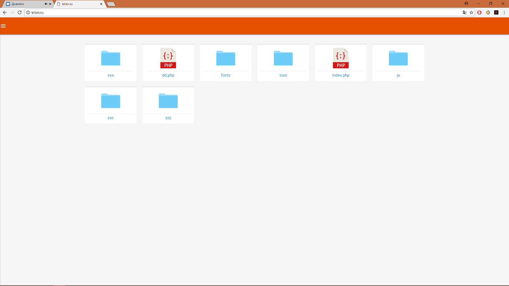
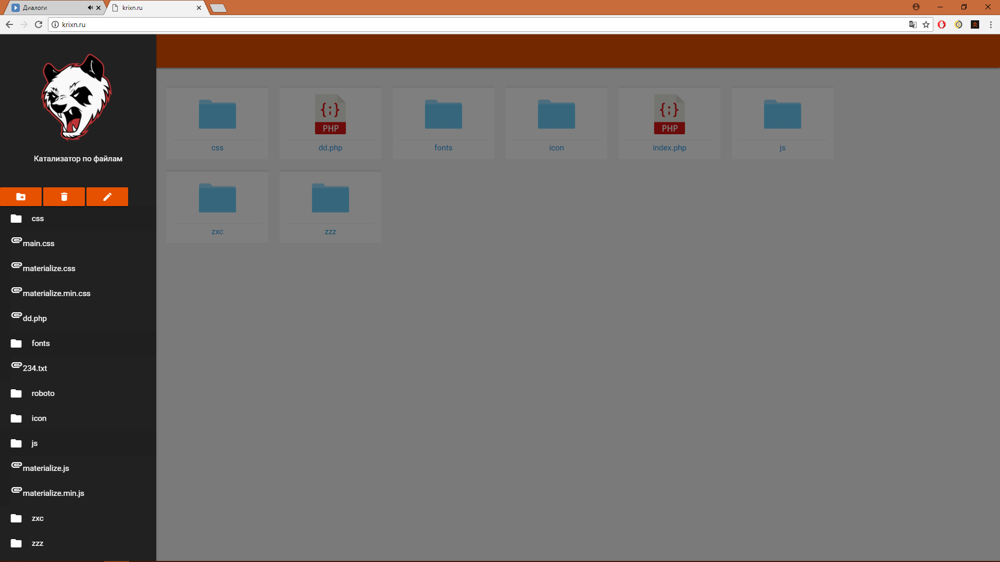
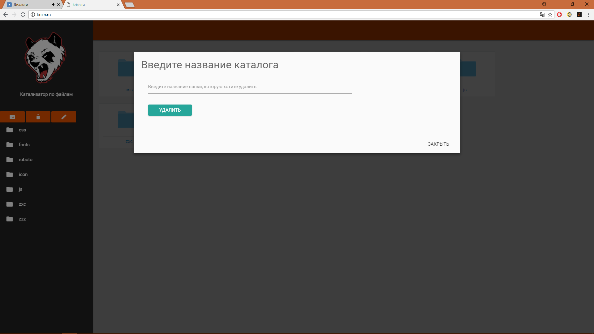
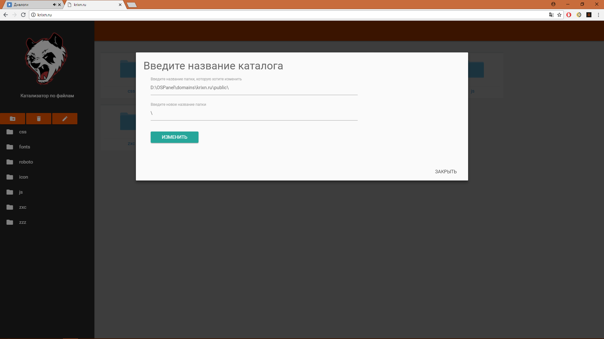

# catolizator

## Информация о приложении
> Католизатор по файлам.  
-Создаёт новые каталоги.    
-Просматривает данные каталоги.    
-Изменяет данные каталоги.    
-Удаляет данные каталоги.    
P.S За основу был взят фреймворк materialize

## Скриншоты

### Автор

Nikita Naidenov
(https://vk.com/krixn)

### Версия

0.1.0

### License

This project is licensed under the MIT License
